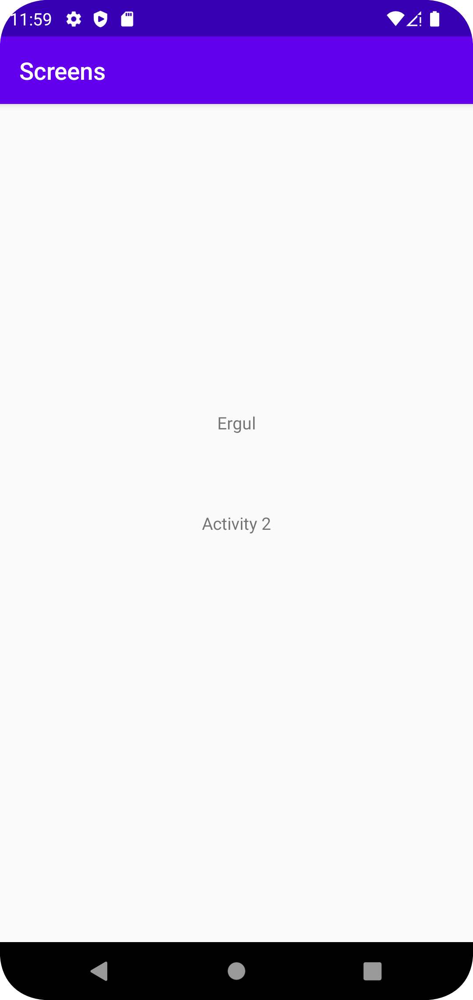

# Rapport

Jag har skapat en ny aktivitet "Activity2.java" och sedan skapar jag en knapp på activity_main.xml samt kopplar MainActivity.java till Activity2.java. Sedan implementerar jag koden som syns nedan och detta lägger till data genom en intent. Till sist lägger jag till en widget på Activity2 och visar upp datan.


```
    public void openActivity2() {
        Intent intent = new Intent(this, Activity2.class);

        Intent intent = new Intent(MainActivity.this, Activity2.class);
        intent.putExtra("name", "Daniel"); // Optional
        intent.putExtra("number", 1); // Optional
        startActivity(intent);
    }
    
        protected void onCreate(Bundle savedInstanceState) {
        super.onCreate(savedInstanceState);
        setContentView(R.layout.activity_main2);

        Bundle extras = getIntent().getExtras();
        if (extras != null) {
            String name = extras.getString("name");
            int number = extras.getInt("number");
            // Do something with the name and number n
        }
    }
```


